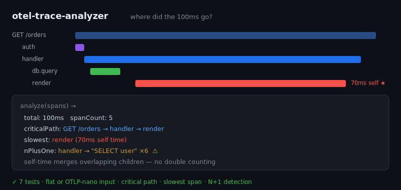

# otel-trace-analyzer

[](https://github.com/JCreatesGH/otel-trace-analyzer/actions)
[](https://www.typescriptlang.org/)
[](LICENSE)

Find where a request's latency actually went. `otel-trace-analyzer` loads an OpenTelemetry trace and computes the **critical path**, the **slowest span by self-time**, and **N+1 patterns** — the three things you look for first when a trace is slow.



## Install

```bash
npm install otel-trace-analyzer
```

## Use it

```ts
import { loadSpans, analyze } from "otel-trace-analyzer";

const spans = loadSpans(otlpJson);     // flat array or { spans: [...] }, ms or OTLP nanos
const a = analyze(spans);

a.total          // end-to-end duration
a.criticalPath   // ["GET /orders", "handler", "render"]
a.slowest        // { name: "render", selfTime: 70 }
a.nPlusOne       // [{ parent: "handler", childName: "SELECT user", count: 6 }]
```

## What it computes

- **Self time** — a span's exclusive time, *merging overlapping children* so concurrent work isn't double-counted. This is what makes "slowest span" actually correct.
- **Critical path** — from the root, follow the latest-ending child to the finish; that chain is what determines end-to-end latency.
- **N+1 detection** — a parent with many identically-named children (the classic repeated-DB-call smell).

Input is tolerant: a flat list of spans with `start`/`end`, or OTLP-style `startTimeUnixNano`/`endTimeUnixNano` (auto-converted to ms).

## Development

```bash
npm install && npm test    # 7 tests
npm run build              # tsc, clean
```

## License

MIT
